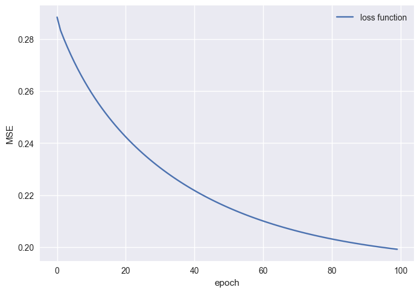
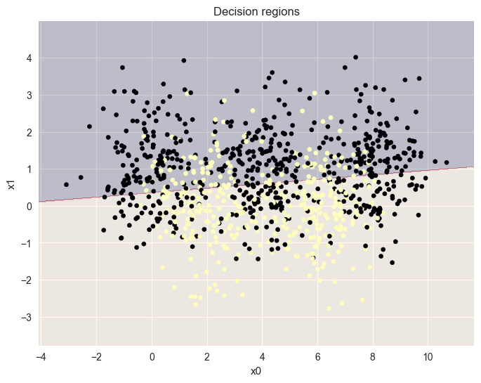
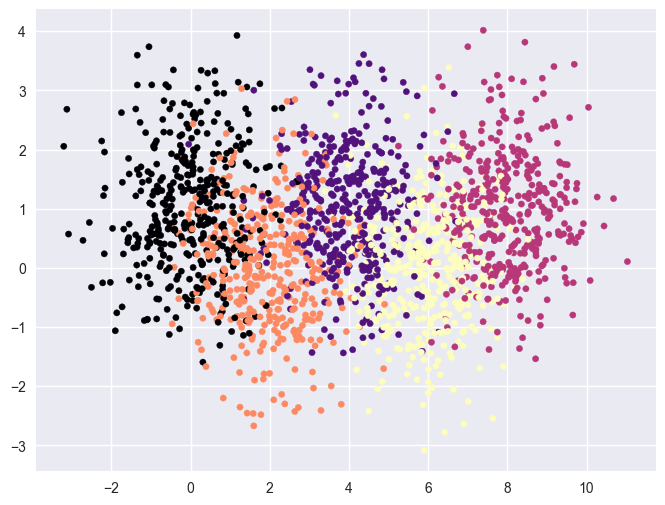
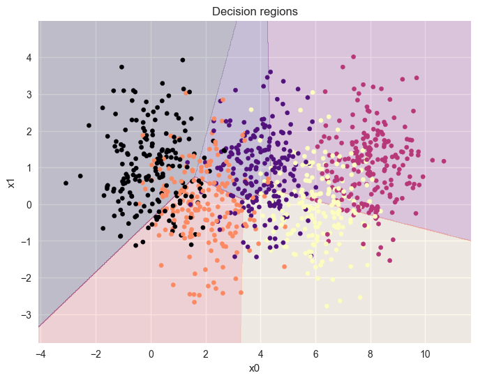
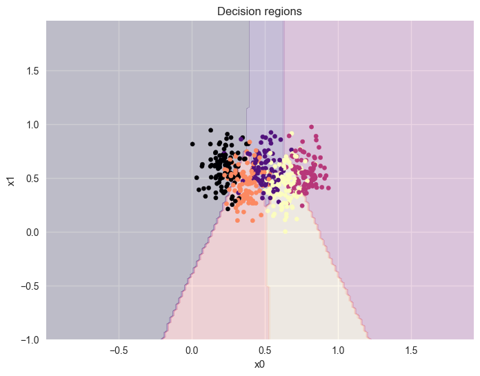

# Assignment 2 IN3050
### **Sophus B. Gullbekk**

##  
# Part 1: Linear classifiers

### **Taks 1**: Linear regression on a binary dataset

We make a linear regression class which uses MSE as the loss function. To find appropriate values for the 
learning rate $eta$ and the number of epochs, the classifier is run with different values and stores the ones that gave the best accuracy. 

The parameters found are:
```sh
eta = 0.042625 : epochs = 100 : acc = 0.644
```

The result is far from impressive. This is expected since (X, t2) is not linearly separable. The resulting decision boundaries are given in the figure below.

    

    


### Loss
The linear regression classifier is trained with mean squared error loss. We modify the code so that the loss is saved after each epoch. The figure below shows the loss against the number of epochs. 

    

    


### Control training

We implement the class with a keyword argument *loss_diff*, that stops the training if the loss is not improved more than *loss_diff*. We also implement a keyword argument for a validation set, that test the classifier each epoch. 

In the figure below, we show the accuracy of the classifier on both the training- and validation set for each epoch as well as the loss in two subplots. We see that the accuracy is increasing in a linear fashion until it reaches about 65% on the evaluation set and 70% on the training set.
This is about as good of a result we can hope for, since the dataset is not separable. 
The loss decreases approximately as 1/epoch and we see that training with more epochs would give diminishing returns. 


    


### **task 2**: Logistic regression on a binary dataset

We perform a similar brute force algorithm to find suitable parameters for the logistic regression classifier and get the following results:

```sh
eta = 0.334 : epochs = 100 : acc = 0.672
```

The results after running logistic regression on (X_train, t_train) is represented by the decision boundaries shown in the figure below.
    

    


Similarly as before, we plot accuracy and loss for both the training and validation data in two subplots.
Wee see similar end results after 100 epochs to what we got with the linear classifier, but it stabilizes much quicker, and with a less regular pattern. 
    

    


## **Task 3**: Multi-class classifiers
We turn to the task of classifying when there are more than two classes, and the task is to ascribe one class to each input. We will now use the set (X, t) which is shown below. 

    

    
To implement the multi-class classifier we use the one-vs-rest approach on the logistic regression classifier.
We run the model with the same parameters as the logistic regression classifier and get the following accuracy:

```
accuracy = 0.678
```


The decision boundaries are shown in the figure below. 


    

# Part II: Multi-layer neural networks
We will implement the Multi-layer feed forward network (MLP, Marsland sec. 4.2.1), where we use mean squared loss together with logistic activation in both the hidden and the last layer.

## Multi-class

As before we use brute force to tune the hyperparameters. The parameters we can change are the learning rate $eta$, the dimension of the hidden layer, as well as the number of epochs. 
When running the algorithm with the dataset (X, t) we get the following results:

```
best_acc = 0.78, best_eta = 0.005, best_dim_hidden = 9, best_epochs = 5000
```

We use the found parameters and run the classifier 20 times and calculate the standard deviation and the accuracies each time. We use int(time.time) as the seed for the rng each run. The results are

```
Standard deviation after 10 runs: 0.0037, mean value after 10 runs: 0.7726
```

And the decision boundary of one of the runs are shown below. 



We see that the decision boundaries of the classifier is more accurate than the ones produced using the one-vs-rest classifier. This might be because we are no longer limited to linear boundaries. 


## Binary class

Now we run the same multilayer nerual network on the binary dataset (X, t2).
As before, we use brute force to find the following hyper parameters:
```
best_acc_t2 = 0.772, best_eta_t2 = 0.05, best_dim_hidden_t2 = 12, best_epochs_t2 = 5000
```

We run the experiment 10 times and report the standard deviation and mean accuracy:
```
Standard deviation after 10 runs: 0.0121, mean value after 10 runs: 0.7560
```

The decision boundaries from one of the runs are given in the figure below.


    

    

# Part III: Final testing
We can now perform a final testing on the held-out test set.

## Binary task (X, t2)

We train the linear regression classifier, the logistic regression clssifier and the multi-layer network with the parameters we found in the previous tasks. The results are given in the top table below.

We see that the multi-layer network outperform the other classifers on all the datasets. On the linear and logistic classifiers we see that the results on the training data is better than on the other data, but this is not the case on the multi-layer network. Although the results are similar on all datasets for all three classifiers. This might mean that the multi-layer network creates a more robust and general classifier. 


## Multi-class task (X, t)
We do a similar comparison between the one-vs-rest classifier and the multi-layer network on the (X, t) dataset. 
Again we see that the multi-layer network performs best.
This time, however, we see that both perform best on the test data, which can mean that the classifiers are robust and not overfitted. 


```
Accuracy for the different models using t2:
╒════════════╤═══════════════╤═══════════════╤═══════════════════════╕
│ data set   │   NumpyLinReg │   NumpyLogReg │   Multi-layer network │
╞════════════╪═══════════════╪═══════════════╪═══════════════════════╡
│ X_train    │         0.659 │         0.614 │                 0.734 │
├────────────┼───────────────┼───────────────┼───────────────────────┤
│ X_val      │         0.64  │         0.574 │                 0.73  │
├────────────┼───────────────┼───────────────┼───────────────────────┤
│ X_test     │         0.646 │         0.6   │                 0.754 │
╘════════════╧═══════════════╧═══════════════╧═══════════════════════╛
Accuracy for the different models using t:
╒════════════╤═══════════════╤═══════════════════════╕
│ data set   │   One-vs-rest │   Multi-layer network │
╞════════════╪═══════════════╪═══════════════════════╡
│ X_train    │         0.724 │                 0.793 │
├────────────┼───────────────┼───────────────────────┤
│ X_val      │         0.706 │                 0.766 │
├────────────┼───────────────┼───────────────────────┤
│ X_test     │         0.74  │                 0.798 │
╘════════════╧═══════════════╧═══════════════════════╛
```

